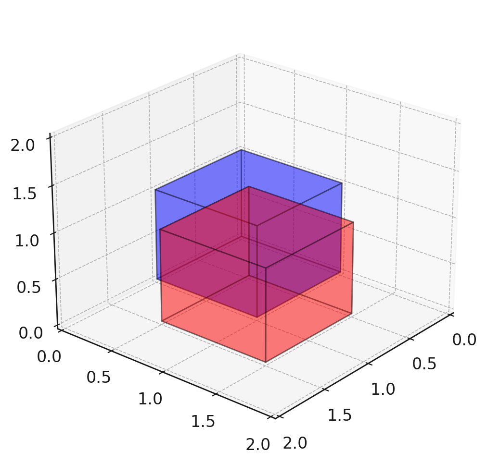

## OpenGJKSharp
OpenGJKSharp is a C# native implementation of the GJK (Gilbert-Johnson-Keerthi) algorithm, designed for efficient collision detection between convex polyhedra in 3D space.
This project is inspired by the original [openGJK](https://github.com/MattiaMontanari/openGJK) (written in C) and reimagined for the .NET ecosystem.

## Installation
You can install `OpenGJKSharp` via NuGet:

``` bash
dotnet add package OpenGJKSharp --version 0.0.4
```

Or using the Package Manager:

``` bash
Install-Package OpenGJKSharp -Version 0.0.4
```

## Usage

Here is an example of detecting a collision between two overlapping cubes:

``` c#
using OpenGJKSharp;

// Cube 1
var a = new Vector3[]
{
    new(0, 0, 0),
    new(1, 0, 0),
    new(0, 1, 0),
    new(1, 1, 0),
    new(0, 0, 1),
    new(1, 0, 1),
    new(0, 1, 1),
    new(1, 1, 1),
};

// Cube 2
var b = new Vector3[]
{
    new(0.5f, 0.5f, 0),
    new(1.5f, 0.5f, 0),
    new(0.5f, 1.5f, 0),
    new(1.5f, 1.5f, 0),
    new(0.5f, 0.5f, 1),
    new(1.5f, 0.5f, 1),
    new(0.5f, 1.5f, 1),
    new(1.5f, 1.5f, 1),
};

bool hasCollision = OpenGJKSharp.HasCollision(a, b);

Console.WriteLine($"Collision detected: {hasCollision}"); // Outputs: true
```

The following image illustrates the collision between the two cubes:

